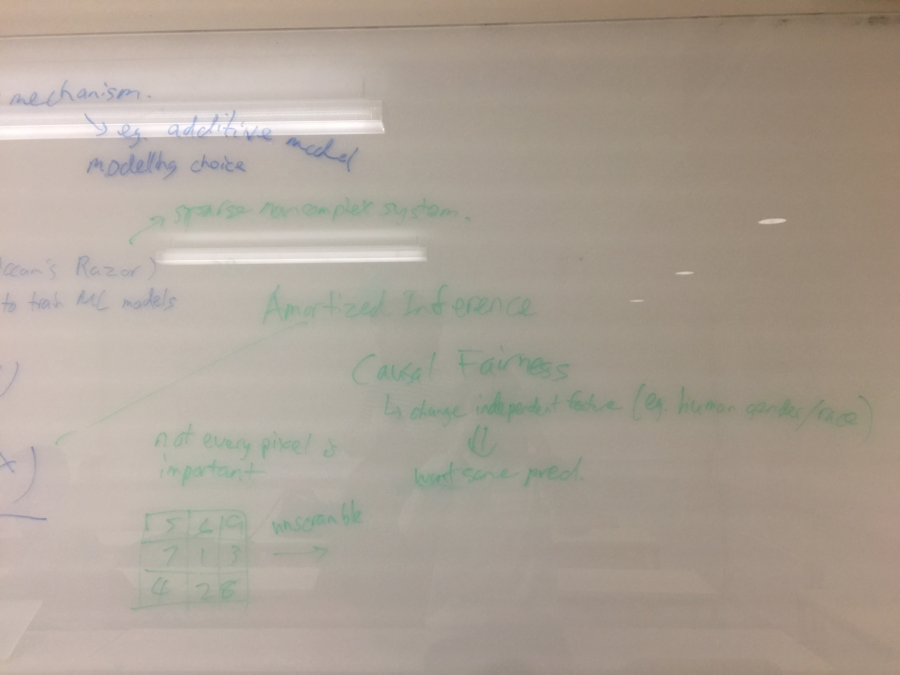
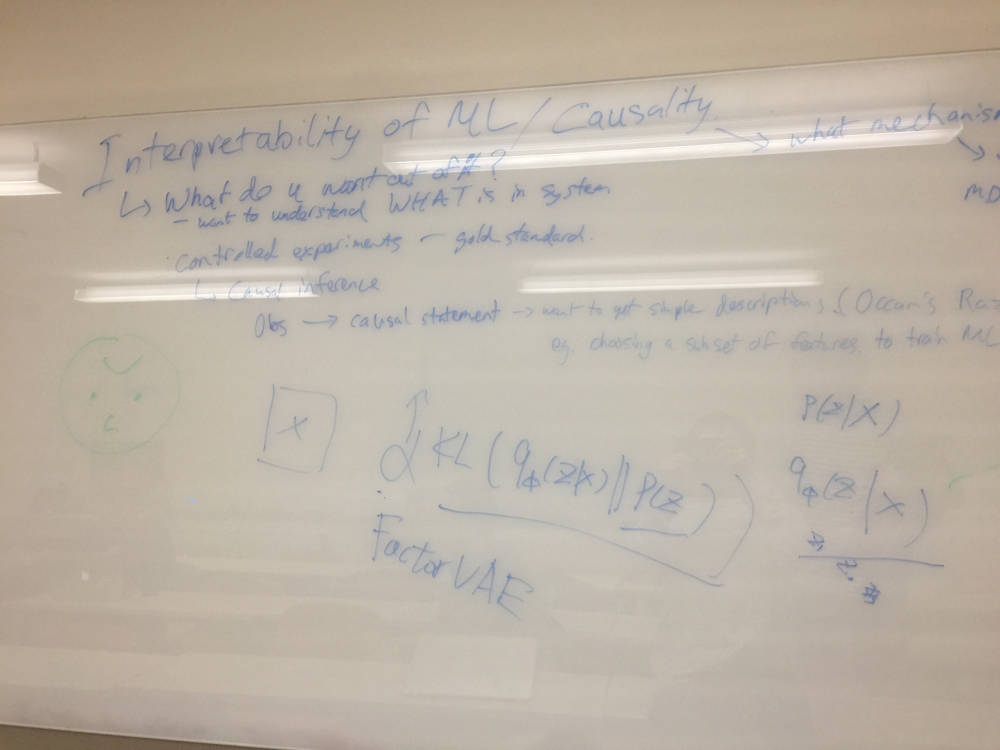

# Unconference 1

Nothing much came out of the 45 minute discussion since the participants came from diverse backgrounds. Here's the rough whiteboard notes that were developed from the unconference:

Concepts covered during the unconference included:

* beta-VAE \(and its relation to variational inference\)
* possible relationship between disentanglement and causal inference.
* causal additive models
* forming and scrambling fix-sized image blocks for unsupervised representation learning

